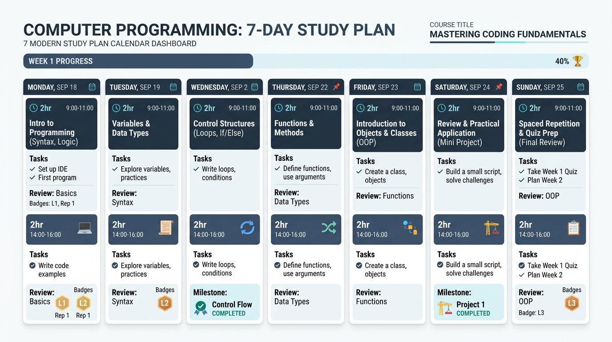

# StudyAI — Asistente Inteligente para la Generación de Planes de Estudio

> **Proyecto Final Académico**  
> **Curso:** *IA: Entretejiendo Imaginación y Algoritmos*  
> **Autor:** Lucas Tello  
> **Especialidad:** Inteligencia Artificial Generativa, Prompt Engineering & Fast Prompting  
> **Repositorio Oficial:** [https://github.com/LucasSTello/Inteligencia-artificial--Generaci-n-de-Prompts](https://github.com/LucasSTello/Inteligencia-artificial--Generaci-n-de-Prompts)

---

## 1. Descripción del Proyecto

**StudyAI** es una Proof of Concept (POC) multimodal diseñada para transformar la desorganización y sobrecarga cognitiva que experimentan los estudiantes universitarios al preparar exámenes o materias complejas. A través de la combinación de modelos de lenguaje de gran escala (**OpenAI GPT**) y síntesis visual generativa (**Texto-a-Imagen**), el sistema convierte un conjunto de datos académicos del alumno en un **plan de estudio integral estructurado en 9 bloques pedagógicos**, complementado por un **recurso visual (dashboard/infografía semanal)** que sintetiza la cadencia de estudio.

El desarrollo del proyecto demuestra de forma empírica y rigurosa cómo la aplicación deliberada de técnicas avanzadas de **Fast Prompting** permite evolucionar desde instrucciones elementales e ineficaces hasta un plan de estudio hiperpersonalizado, temporalmente viable y fundado en principios de ciencia del aprendizaje.

---

## 2. Problemática

Los estudiantes universitarios y técnicos se enfrentan de forma recurrente a barreras de gestión del aprendizaje:
* **Sobrecarga cognitiva y parálisis por análisis:** Dificultad para ordenar y jerarquizar programas extensos con múltiples dependencias conceptuales.
* **La falacia de la planificación:** Subestimación sistemática del tiempo requerido para dominar conceptos complejos, derivando en sesiones maratónicas improductivas en la víspera del examen.
* **Ilusión de competencia por lectura pasiva:** Ausencia de métodos de estudio activo y postergación de la práctica deliberada.
* **Degradación del recuerdo por la curva del olvido:** Falta de repaso espaciado acumulativo, lo que provoca que lo aprendido al inicio del periodo se olvide antes de la evaluación.

---

## 3. Propuesta de Solución

StudyAI resuelve estas fricciones actuando como un **andamiaje metacognitivo automatizado**:
1. **Captura Parametrizada:** Recibe 8 variables críticas del alumno (materia, temas, días disponibles, horas por día, nivel de partida, fecha de examen, objetivo y preferencias pedagógicas).
2. **Inyección Dinámica de Fast Prompting:** Ensambla un prompt optimizado con rol pedagógico, restricciones negativas de cero alucinación, invariancia matemática del presupuesto temporal y micro-patrones *Few-Shot*.
3. **Generación Textual Estructurada (OpenAI GPT):** Produce un plan en Markdown de 9 secciones obligatorias, con desglose minuto a minuto, autoevaluaciones y repasos espaciados.
4. **Síntesis Multimodal (Texto-a-Imagen):** Genera una infografía semanal en formato dashboard que proporciona un mapa visual holístico (*bird's-eye view*) de la semana de estudio.

---

## 4. Objetivos del Proyecto

* **Objetivo General:** Desarrollar una Proof of Concept (POC) multimodal utilizando modelos generativos texto-texto y texto-imagen, aplicando técnicas de Fast Prompting para generar planes de estudio personalizados y recursos visuales complementarios.
* **Objetivos Específicos:**
  1. Diseñar y validar tres versiones sucesivas del prompt (V1 Básico, V2 Estructurado, V3 Optimizado).
  2. Implementar un constructor dinámico en Python y un controlador de ejecución dual (Online con API de OpenAI y Modo Simulación Académica Offline).
  3. Evaluar cualitativamente los resultados mediante una matriz multidimensional de 6 criterios sin inventar métricas ficticias.
  4. Diseñar e incorporar un recurso visual infográfico que complemente la cognición del alumno.
  5. Asegurar un estándar riguroso de reproducibilidad y seguridad de credenciales en GitHub.

---

## 5. Tecnologías y Herramientas

| Componente | Tecnología / Herramienta | Función en el Proyecto |
|:---|:---|:---|
| **Lenguaje** | Python 3.10+ | Lenguaje base para el pipeline de datos y lógica de ejecución. |
| **Entorno** | Jupyter Notebook (`.ipynb`) | Cuaderno interactivo con las 30 secciones académicas documentadas. |
| **Modelo Texto-Texto** | OpenAI GPT (`gpt-4o-mini` / `gpt-4o`) | Razonamiento contextual, priorización temática y redacción del plan. |
| **Modelo Texto-Imagen** | Herramienta Generativa Visual | Síntesis visual del calendario semanal en estilo dashboard educativo 16:9. |
| **Seguridad** | `python-dotenv` | Lectura de claves API desde archivo `.env` aislado del control de versiones. |
| **Renderizado** | `IPython.display`, `Pillow`, `Matplotlib` | Visualización en tiempo de ejecución de tablas, Markdown y recursos gráficos. |

---

## 6. Metodología de Fast Prompting Aplicada

En StudyAI, cada técnica de *Fast Prompting* tiene una justificación funcional concreta:

* **Role Prompting:** Asigna al modelo la identidad de *Asesor Académico de Élite y Especialista en Ciencia del Aprendizaje*, modulando el vocabulario y enfoque pedagógico.
* **Context Prompting:** Inyecta las variables del alumno para erradicar la ambigüedad situacional.
* **Instruction Prompting:** Imparte mandatos secuenciales y específicos de estructuración.
* **Few-Shot Prompting:** Modela un micro-patrón horario diario (bloques de 15, 30, 40 y 50 minutos con pausas) garantizando consistencia sintáctica.
* **Structured Prompting:** Uso de separadores, tablas Markdown y listas jerarquizadas para optimizar la atención del modelo.
* **Restricciones Explícitas (*Negative Constraints* & *Grounding*):** Prohíbe inventar contenidos y exige que la suma de minutos de cada día sea estrictamente igual a las horas asignadas (ej. 120 minutos).
* **Descomposición de Tareas (*Task Decomposition*):** Divide la tarea en los 9 bloques pedagógicos obligatorios.
* **Iteración y Refinamiento:** Proceso empírico documentado a través de las versiones V1, V2 y V3.

---

## 7. Estructura del Repositorio

```text
StudyAI /
│
├── README.md                           # Documentación maestra del proyecto
├── StudyAI_Proyecto_Final.ipynb         # Notebook interactiva con las 30 secciones requeridas
├── requirements.txt                    # Lista de dependencias del entorno Python
├── .gitignore                          # Exclusión de archivos sensibles (.env) y temporales
├── .env.example                        # Plantilla de configuración segura de credenciales
│
├── prompts/                            # Trazabilidad modular de los prompts diseñados
│   ├── prompt_texto_texto_v1.txt       # Prompt V1 (Básico)
│   ├── prompt_texto_texto_v2.txt       # Prompt V2 (Estructurado)
│   ├── prompt_texto_texto_v3.txt       # Prompt V3 (Optimizado con Fast Prompting)
│   └── prompt_texto_imagen.txt         # Prompt para infografía visual semanal
│
├── images/                             # Recursos gráficos generados
│   └── plan_estudio_generado.png       # Infografía generada del calendario semanal (16:9)
│
└── docs/                               # Documentación complementaria
    └── metodologia.md                  # Desarrollo exhaustivo del marco de Fast Prompting
```

---

## 8. Caso de Estudio y Variables de Entrada

Para validar la POC se utilizó el siguiente caso de prueba estandarizado:
* **Materia:** Programación
* **Temas:** Variables, Condicionales, Bucles, Funciones, Arrays, Objetos, Programación orientada a objetos
* **Días disponibles:** 7 días
* **Horas por día:** 2 horas/día (120 minutos diarios / 14 horas totales)
* **Nivel de conocimiento:** Intermedio
* **Fecha del examen:** En 7 días
* **Objetivo académico:** Prepararse para un examen teórico-práctico
* **Preferencias de estudio:** Sesiones cortas, ejercicios prácticos y repasos

---

## 9. Modelo Texto-Texto: Evolución de Versiones

### Progresión Experimental
1. **Prompt V1 — Básico:** Redacción informal en lenguaje natural. Produjo una lista plana sin distribución temporal interna, postergando el repaso al último día e ignorando las preferencias de sesiones cortas.
2. **Prompt V2 — Estructurado:** Incorporó rol institucional, delimitación Markdown y restricciones básicas. Mejoró la legibilidad pero mantuvo actividades genéricas y omitió técnicas activas de aprendizaje.
3. **Prompt V3 — Optimizado (Fast Prompting):** Incorporó los micro-ejemplos Few-Shot, restricciones negativas de tiempo exacto y descomposición en las **9 secciones obligatorias**:
   1. Resumen de la situación académica
   2. Matriz de priorización de contenidos
   3. Plan organizado por día (Día 1 al 7 con minutos exactos)
   4. Tabla de presupuesto temporal consolidado (120 min exactos/día)
   5. Objetivos de aprendizaje operativos
   6. Técnicas de estudio activo (Pomodoro 40/10, Active Recall, Feynman)
   7. Cronograma de repaso espaciado (Ebbinghaus)
   8. Autoevaluaciones, retos de código y simulacro de examen
   9. Recomendaciones finales y gestión del descanso (regla de las 12 horas)

### Matriz Cualitativa Comparativa

| Criterio | Versión 1 (Básico) | Versión 2 (Estructurado) | Versión 3 (Optimizado Fast Prompting) |
|:---|:---|:---|:---|
| **Claridad** | Coloquial y elemental. | Profesional y ordenada. | Óptima; didáctica y precisa. |
| **Organización** | Párrafos planos sin jerarquía. | Secciones Markdown por día. | Modular en 9 secciones, tablas y minutos exactos. |
| **Personalización** | Nula; genérica. | Moderada (respeta días/horas). | Profunda (adapta ratio práctica, descansos y nivel). |
| **Cumplimiento** | Muy bajo. | Aceptable. | Estricto (100% de requerimientos y balance temporal). |
| **Utilidad** | Muy baja; impracticable. | Regular (guía orientativa). | Máxima; agenda diaria inmediatamente accionable. |
| **Consistencia** | Errática. | Estable en estructura básica. | Robusta gracias al anclaje Few-Shot y Markdown delimitado. |

---

## 10. Modelo Texto-Imagen y Recurso Visual

Se diseñó un prompt profesional para generar un dashboard visual complementario en formato panorámico (16:9), almacenado en `images/plan_estudio_generado.png`:



### Sinergia Multimodal (Teoría de la Doble Codificación)
* **La Infografía Visual:** Proporciona una visión holística (*bird's-eye view*) que reduce la ansiedad del estudiante y permite monitorear el progreso semanal y los hitos clave de un vistazo.
* **El Plan Textual:** Provee las instrucciones tácticas minuto a minuto (*ground-level execution*) con los desafíos y ejercicios específicos de cada jornada.

---

## 11. Instalación y Requisitos

### Requisitos Previos
* Python 3.10 o superior instalado.
* Gestor de paquetes `pip` o `uv`.

### Clonación del Repositorio
```bash
git clone https://github.com/LucasSTello/Inteligencia-artificial--Generaci-n-de-Prompts.git
cd "Inteligencia-artificial--Generaci-n-de-Prompts"
```

### Instalación de Dependencias
```bash
pip install -r requirements.txt
```

---

## 12. Configuración de Seguridad y Credenciales

StudyAI aplica las mejores prácticas de seguridad en desarrollo con IA:
1. **Nunca expone credenciales en código ni en control de versiones.**
2. Copia la plantilla `.env.example` para crear tu propio archivo `.env`:
   ```bash
   cp .env.example .env
   ```
3. Edita `.env` e ingresa tu API Key de OpenAI:
   ```env
   OPENAI_API_KEY=sk-proj-tu_clave_real_aqui
   OPENAI_MODEL=gpt-4o-mini
   ```
4. El archivo `.env` se encuentra explícitamente ignorado por `.gitignore`.

> **Modo Simulación Académica (Fallback Automático):** Si no dispones de una clave API de OpenAI o no deseas incurrir en costos, **la Notebook funciona de todas formas**. El sistema detecta automáticamente la ausencia de clave y activa el modo determinista de laboratorio que entrega los resultados experimentales reales registrados.

---

## 13. Ejecución de la Notebook

Para iniciar el entorno interactivo y recorrer las 30 secciones:

```bash
jupyter notebook StudyAI_Proyecto_Final.ipynb
```
O ábrelo directamente desde Visual Studio Code o JupyterLab seleccionando el kernel de Python 3 correspondiente.

---

## 14. Conclusiones y Alcance de la POC

* **Logros:** Se comprobó que el diseño sistemático de prompts mediante Fast Prompting es el factor crítico para transformar la salida de un LLM de un texto genérico a un plan de estudio pedagógicamente riguroso y aplicable.
* **Limitaciones de la POC:** La solución actual es una prueba de concepto en Notebook sin interfaz web interactiva ni sincronización en tiempo real con calendarios externos (Google Calendar o Notion).
* **Trabajo Futuro:** Implementación de UI web interactiva (Streamlit) y exportación automática a formato `.ics`.

---

## 15. Referencias

1. **Brown, T. B., et al. (2020).** *Language Models are Few-Shot Learners.* NeurIPS 2020.
2. **Wei, J., et al. (2022).** *Chain-of-Thought Prompting Elicits Reasoning in Large Language Models.* NeurIPS 2022.
3. **Dunlosky, J., et al. (2013).** *Improving Students’ Learning With Effective Learning Techniques.* Psychological Science in the Public Interest.
4. **Ebbinghaus, H. (1885 / 1913).** *Memory: A Contribution to Experimental Psychology.*
5. **Sweller, J. (1988).** *Cognitive Load During Problem Solving: Effects on Learning.* Cognitive Science.
6. **Paivio, A. (1986).** *Mental Representations: A Dual Coding Approach.* Oxford University Press.
7. **OpenAI (2024).** *Prompt Engineering Guide and Best Practices.* Platform Documentation.